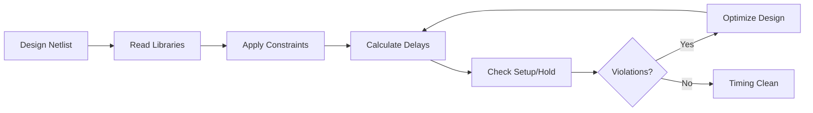

# Static Timing Analysis (STA) - Fundamentals Guide

## Introduction

Static Timing Analysis (STA) is a critical verification methodology in digital circuit design that validates timing requirements **without requiring input test vectors or dynamic simulation**. Unlike functional simulation that checks specific scenarios, STA exhaustively analyzes all possible timing paths to ensure the circuit operates correctly at the target clock frequency.

**Key Advantage:** STA provides complete timing coverage by mathematically analyzing all paths, identifying potential timing violations before chip fabrication—saving time and costs.

---

## Table of Contents

- [Clock Fundamentals](#clock-fundamentals)
- [Timing Path Components](#timing-path-components)
- [Path Categories](#path-categories)
- [Slack Calculation](#slack-calculation)
- [Setup and Hold Analysis](#setup-and-hold-analysis)
- [Timing Constraints](#timing-constraints)
- [Timing Libraries](#timing-libraries)
- [Summary](#summary)

---

## Clock Fundamentals

Clocks serve as the timing reference in synchronous digital circuits. All timing calculations derive from clock definitions, making accurate clock specification crucial for reliable STA.

### Essential Clock Parameters

| Parameter | Description | Impact on Timing |
|-----------|-------------|------------------|
| **Clock Period** | Duration of one complete clock cycle (T = 1/frequency) | Defines maximum combinational delay allowed |
| **Clock Edge** | Instant when flip-flops sample data (rising/falling) | Reference point for setup/hold checks |
| **Clock Skew** | Arrival time difference between clock reaching different registers | Can cause setup/hold violations if excessive |
| **Clock Uncertainty** | Variations due to jitter, PVT (Process, Voltage, Temperature) | Added margin to account for unpredictability |
| **Clock Latency** | Propagation delay through clock distribution network | Affects actual clock arrival times at flip-flops |
| **Gated Clocks** | Selectively disabled clocks for power savings | Requires special analysis for enable/disable transitions |

**Example:**
```
Clock Period = 10ns (100 MHz)
Clock Skew = 0.5ns
Clock Uncertainty = 0.3ns
Effective timing budget = 10ns - 0.5ns - 0.3ns = 9.2ns
```

>  **Note:** Poor clock tree design can consume significant timing margin through skew and latency.

---

## Timing Path Components

### What is a Timing Path?

A timing path represents the complete route a signal travels between two sequential elements or boundary points in a circuit. Understanding these components is fundamental to timing analysis.

**Path Structure:**

```
[Launch Point] → [Combinational Logic] → [Capture Point]
       ↑                                        ↑
   Clock Path 1                            Clock Path 2
```

### Path Elements

1. **Launch Point (Start)**
   - Flip-flop output (Q pin)
   - Primary input port
   - Memory read output
   - Where data originates

2. **Combinational Logic Path**
   - Logic gates (AND, OR, NAND, etc.)
   - Multiplexers and decoders
   - Arithmetic units (adders, multipliers)
   - Interconnect wires
   - All non-clocked logic between start and end

3. **Capture Point (End)**
   - Flip-flop input (D pin)
   - Primary output port
   - Memory write input
   - Where data is sampled/captured

4. **Clock Network**
   - Clock tree buffers
   - Clock gating cells
   - Distribution wires
   - Delivers timing reference

**Why It Matters:** STA analyzes every possible timing path to ensure data propagates correctly within timing constraints. The longest path determines maximum frequency (critical path).

---

## Path Categories

STA examines multiple path types, each with distinct characteristics and timing requirements:

### 1. Register-to-Register (Reg2Reg) Path
**Most Common Path Type**

```
[FF1:CLK] → [FF1:Q] → [Combo Logic] → [FF2:D] → [FF2:CLK]
```

- **Launch:** Data exits flip-flop 1 at clock edge
- **Propagate:** Signal travels through combinational logic
- **Capture:** Data must arrive at flip-flop 2 before next clock edge
- **Constraint:** Total delay < Clock Period - Setup Time - Clock Skew

**Example:**
```
Clock Period = 10ns
FF1 CK→Q = 0.5ns
Combo Delay = 7ns
FF2 Setup = 0.8ns
Path Slack = 10 - 0.5 - 7 - 0.8 = 1.7ns (PASS)
```

---

### 2. Input-to-Register (In2Reg) Path

```
[Input Port] → [Combo Logic] → [FF:D] → [FF:CLK]
```

- **Launch:** External signal arrives at chip input
- **Constraint:** Must meet flip-flop setup time
- **Defined by:** `set_input_delay` constraint
- **Common Issue:** Insufficient time budgeted for external delays

**Purpose:** Ensures external signals properly synchronize with internal clock domain.

---

### 3. Register-to-Output (Reg2Out) Path

```
[FF:CLK] → [FF:Q] → [Combo Logic] → [Output Port]
```

- **Launch:** Data exits internal flip-flop
- **Constraint:** Must arrive at output within specified time
- **Defined by:** `set_output_delay` constraint
- **Common Issue:** Output buffer delays not accounted for

**Purpose:** Guarantees outputs meet timing requirements of downstream devices.

---

### 4. Input-to-Output (In2Out) Path

```
[Input Port] → [Combo Logic] → [Output Port]
```

- **Purely Combinational:** No flip-flops involved
- **Challenge:** No clock reference for timing
- **Constraint:** Defined by input/output delay specifications
- **Risk:** Can create combinational loops if not carefully designed

**Use Case:** Pass-through signals, address decoders, multiplexers.

---

### 5. Clock Gating Paths

```
[Enable Logic] → [AND Gate] → [Gated Clock] → [FF:CLK]
```

- **Purpose:** Power reduction by disabling unused clock branches
- **Timing Check:** Enable must be stable before clock arrival
- **Special Constraint:** Setup/hold on gating enable signal
- **Tool Command:** `set_case_analysis` or `set_clock_gating_check`

**Why Important:** Incorrect gating can cause glitches or clock integrity issues.

---

### 6. Recovery/Removal Paths (Asynchronous Control)

**Recovery Time:**
```
[Reset Deassert] →(min time)→ [Next Clock Edge]
```
- Ensures flip-flop is ready to capture data after async reset release
- Recovery Violation: Reset released too close to clock edge

**Removal Time:**
```
[Clock Edge] →(min time)→ [Reset Assert]
```
- Ensures flip-flop doesn't capture incorrect data during reset
- Removal Violation: Reset asserted too soon after clock

**Critical for:** Designs with asynchronous resets or sets.

---

### 7. Data-to-Data Paths

```
[Combo Output 1] → [Combo Logic] → [Combo Output 2]
```

- **No Clock Involved:** Both endpoints are combinational outputs
- **Check Type:** Max delay constraint (prevent glitches)
- **Defined by:** `set_max_delay` constraint
- **Risk:** Race conditions, hazards, temporary invalid states

**Example Use:** Ensuring one signal stabilizes before being used by another.

---

## Slack Calculation

Slack quantifies timing margin—the difference between when a signal must arrive (Required Time) and when it actually arrives (Arrival Time).

### Slack Formula

```
Slack = Required Time - Arrival Time
```

### Arrival Time Calculation

**Arrival Time** = Time when signal actually reaches endpoint

```
Arrival Time = Launch Clock Edge 
             + Clock Latency (Launch)
             + Clock-to-Q Delay
             + Combinational Path Delay
```

**Example:**
```
Launch Clock Edge = 0ns
Clock Latency = 1ns
FF CK→Q = 0.5ns
Combo Delay = 6ns
───────────────────
Arrival Time = 7.5ns
```

---

### Required Time Calculation

**Required Time** = Deadline for signal arrival

**For Setup Check:**
```
Required Time = Capture Clock Edge
              + Clock Latency (Capture)
              - Setup Time
              - Clock Uncertainty
```

**Example:**
```
Capture Clock Edge = 10ns
Clock Latency = 1.2ns
Setup Time = 0.8ns
Uncertainty = 0.3ns
───────────────────────────────
Required Time = 10 + 1.2 - 0.8 - 0.3 = 10.1ns
```

---

### Interpreting Slack

| Slack Value | Meaning | Action Required |
|-------------|---------|-----------------|
| **Positive (> 0)** | Timing met with margin | ✅ No action needed |
| **Zero (= 0)** | Timing exactly met | ⚠️ No margin for variation |
| **Negative (< 0)** | Timing violation | ❌ Must fix before tapeout |

**Example:**
```
Required Time = 10.1ns
Arrival Time = 7.5ns
───────────────────────
Slack = 10.1 - 7.5 = 2.6ns (POSITIVE - PASS)
```

**Visual Representation:**

```
Timeline:
0ns          7.5ns        10.1ns
|-------------|-------------|
Launch    Arrival      Required
          (Data        (Deadline)
          Arrives)     
          
<--------- 2.6ns Slack -------->
          (Margin)
```

>  **Key Insight:** The path with the worst (most negative or smallest positive) slack is the **critical path** that limits maximum clock frequency.

---

## Setup and Hold Analysis

### Setup Time Check

**Definition:** Minimum time **before** the clock edge that data must be stable at the flip-flop input.

**Purpose:** Allows flip-flop internal circuitry sufficient time to resolve the input state before capturing it.

#### Why Setup Time Exists

Flip-flops contain internal feedback loops that require time to stabilize. If data changes too close to the clock edge, the flip-flop may enter **metastability**—an unstable state where the output oscillates unpredictably before settling.

**Setup Check Equation:**
```
Data Arrival Time ≤ Clock Edge Time - Setup Time
```

**Violation Consequence:**
- Incorrect data captured
- Metastability propagation
- Unpredictable circuit behavior
- Functional failures

#### Example Scenario

```
Clock Period = 10ns
Setup Time = 0.8ns
Data must arrive by: 10ns - 0.8ns = 9.2ns

If data arrives at 9.5ns → Setup Violation (0.3ns late)
```

**Timing Diagram:**
```
         Setup Window
         <----0.8ns---->
Data:  Stable_______X____Valid_____
                     |
Clock: _____________/‾‾‾‾‾‾\_______
                    ^
                  10ns
```

#### Common Causes of Setup Violations

1. **Long combinational paths** - Too much logic between flip-flops
2. **High clock frequency** - Insufficient time for data propagation
3. **Clock skew** - Late clock arrival at capture flip-flop
4. **Slow standard cells** - Gates with high propagation delay
5. **Routing congestion** - Long interconnect delays

#### Fixing Setup Violations

| Method | Description | Trade-off |
|--------|-------------|-----------|
| **Reduce Logic Depth** | Simplify or pipeline combinational logic | May increase area |
| **Buffer Insertion** | Add buffers to reduce fanout | Increases power |
| **Upsize Gates** | Use faster (larger) cells | Increases area/power |
| **Clock Period Increase** | Reduce operating frequency | Performance loss |
| **Optimize Routing** | Reduce wire lengths | Requires place-and-route tuning |
| **Retiming** | Redistribute registers across logic | Changes circuit structure |

---

### Hold Time Check

**Definition:** Minimum time **after** the clock edge that data must remain stable at the flip-flop input.

**Purpose:** Prevents the newly launched data from corrupting the data being captured at the same flip-flop.

#### Why Hold Time Exists

When a clock edge triggers, the flip-flop begins capturing input data. If the input changes too quickly (due to fast combinational path from the same or another flip-flop), the wrong value may be latched—this creates a **race condition**.

**Hold Check Equation:**
```
Data Arrival Time ≥ Clock Edge Time + Hold Time
```

**Violation Consequence:**
- Wrong data captured
- Race condition between old and new data
- Functional errors that may appear intermittently
- Difficult to debug (corner-case behavior)

#### Example Scenario

```
Clock Edge = 10ns
Hold Time = 0.5ns
Data must remain stable until: 10ns + 0.5ns = 10.5ns

If data changes at 10.3ns → Hold Violation (0.2ns too early)
```

**Timing Diagram:**
```
              Hold Window
              <--0.5ns-->
Data:  Valid_____X______New_Data___
                 |
Clock: _________/‾‾‾‾‾‾\___________
                ^
              10ns
```

#### Common Causes of Hold Violations

1. **Short combinational paths** - Minimal logic between flip-flops
2. **Large clock skew** - Early clock arrival at capture flip-flop
3. **Fast standard cells** - High-speed gates with low delay
4. **Minimal routing delay** - Short interconnects
5. **Clock tree imbalance** - Unequal clock distribution

#### Fixing Hold Violations

| Method | Description | Trade-off |
|--------|-------------|-----------|
| **Insert Delay Buffers** | Add buffers in data path | Increases area/power |
| **Upsize Buffers** | Use larger buffers for more delay | Area increase |
| **Useful Skew** | Intentionally delay launch clock | Requires careful analysis |
| **Route Detours** | Force longer routing paths | May affect other paths |
| **Gate Downsizing** | Use slower (smaller) cells | Reduces performance |

---

### Setup vs Hold: Key Differences

| Aspect | Setup Check | Hold Check |
|--------|-------------|------------|
| **When** | Before clock edge | After clock edge |
| **Ensures** | Data arrives early enough | Data stays stable long enough |
| **Violation Cause** | Long/slow paths | Short/fast paths |
| **Clock Dependency** | Affected by clock period | Independent of clock period |
| **Fix Strategy** | Speed up path | Slow down path |
| **Critical Path** | Determines max frequency | No frequency impact |

---

### Multi-Cycle and False Paths

Sometimes timing requirements differ from default single-cycle analysis:

**Multi-Cycle Path:**
```verilog
set_multicycle_path 2 -setup -to [get_pins FF/D]
set_multicycle_path 1 -hold -to [get_pins FF/D]
```
- Allows path to take multiple clock cycles
- Common in: Slow computational units, divided clocks

**False Path:**
```verilog
set_false_path -from [get_clocks CLK1] -to [get_clocks CLK2]
```
- Tells STA to ignore certain paths
- Used for: Asynchronous clock domains, test logic, unused paths

---

## Timing Constraints

Timing constraints define the rules and requirements that guide STA tools in verifying circuit timing. They specify how clocks behave, when inputs arrive, and when outputs must be valid.

### 1. Clock Constraints

Define the reference timing for the entire design.

**Primary Clock Definition:**
```tcl
create_clock -name CLK -period 10 [get_ports clk]
# Creates a 100MHz clock (10ns period)
```

**Generated Clock:**
```tcl
create_generated_clock -name CLK_DIV2 \
  -source [get_ports clk] \
  -divide_by 2 \
  [get_pins divider/Q]
# Creates a divided clock (50MHz from 100MHz)
```

**Virtual Clock:**
```tcl
create_clock -name VCLK -period 8
# Reference clock not physically present in design
# Used for I/O timing constraints
```

**Clock Uncertainty:**
```tcl
set_clock_uncertainty 0.3 [get_clocks CLK]
# Accounts for jitter, skew, and margin
```

**Clock Latency:**
```tcl
set_clock_latency 2.0 [get_clocks CLK]
# Models clock tree insertion delay
```

---

### 2. Input Constraints

Specify when input signals arrive relative to the clock.

**Input Delay:**
```tcl
set_input_delay -clock CLK -max 3.0 [get_ports data_in]
set_input_delay -clock CLK -min 1.0 [get_ports data_in]
# Data arrives 1-3ns after clock edge at the source
```

**Input Transition:**
```tcl
set_input_transition 0.5 [get_ports data_in]
# Specifies input signal slew rate
```

**Purpose:** Models external device timing, ensuring inputs meet internal flip-flop setup/hold requirements.

---

### 3. Output Constraints

Specify when output signals must be valid for external devices.

**Output Delay:**
```tcl
set_output_delay -clock CLK -max 4.0 [get_ports data_out]
set_output_delay -clock CLK -min 1.5 [get_ports data_out]
# External device expects data 1.5-4ns after its clock
```

**Output Load:**
```tcl
set_load 5.0 [get_ports data_out]
# Capacitive load on output pin (in pF)
```

**Purpose:** Ensures outputs arrive within the timing window expected by downstream components.

---

### 4. Timing Exceptions

Modify default timing analysis for special paths.

**False Path:**
```tcl
set_false_path -from [get_clocks CLK1] -to [get_clocks CLK2]
# Ignore timing between asynchronous clock domains
```

**Multi-Cycle Path:**
```tcl
set_multicycle_path 3 -setup -from [get_pins FF1/Q] -to [get_pins FF2/D]
set_multicycle_path 2 -hold -from [get_pins FF1/Q] -to [get_pins FF2/D]
# Path takes 3 clock cycles instead of 1
```

**Max/Min Delay:**
```tcl
set_max_delay 15 -from [get_ports A] -to [get_ports B]
set_min_delay 2 -from [get_ports A] -to [get_ports B]
# Explicit delay constraints for specific paths
```

---

### 5. Design Rule Constraints

Ensure design meets physical and electrical requirements.

**Max Transition:**
```tcl
set_max_transition 1.0 [current_design]
# Limits signal slew to prevent signal integrity issues
```

**Max Capacitance:**
```tcl
set_max_capacitance 50 [all_outputs]
# Prevents excessive load on outputs
```

**Max Fanout:**
```tcl
set_max_fanout 16 [current_design]
# Limits number of loads on any net
```

---

## Timing Libraries

Timing libraries (`.lib` files) contain essential characterization data for every standard cell in the technology. STA tools use this information to calculate delays, transitions, and power consumption.

### Liberty File Format

```liberty
library (sky130_fd_sc_hd__tt_025C_1v80) {
  delay_model : table_lookup;
  time_unit : "1ns";
  voltage_unit : "1V";
  current_unit : "1mA";
  capacitive_load_unit (1, pf);
  
  operating_conditions (tt_025C_1v80) {
    process : 1.0;
    temperature : 25;
    voltage : 1.8;
  }
  
  cell (sky130_fd_sc_hd__nand2_1) {
    area : 3.752;
    
    pin (A) {
      direction : input;
      capacitance : 0.0024;
    }
    
    pin (Y) {
      direction : output;
      function : "!(A & B)";
      
      timing () {
        related_pin : "A";
        timing_sense : negative_unate;
        cell_rise (delay_template) {
          index_1 ("0.01, 0.05, 0.1, 0.5");
          index_2 ("0.001, 0.01, 0.05, 0.1");
          values (
            "0.123, 0.145, 0.189, 0.234",
            "0.134, 0.156, 0.201, 0.245"
          );
        }
      }
    }
  }
}
```

### Key Library Components

| Component | Description | Usage in STA |
|-----------|-------------|--------------|
| **Cell Delay** | Propagation time through gate | Calculates path delays |
| **Setup/Hold Time** | Flip-flop timing requirements | Validates capture timing |
| **Input Capacitance** | Load presented by input pin | Drives output transition calculations |
| **Output Resistance** | Drive strength of output | Affects downstream delay |
| **Transition Tables** | Slew rate vs. load/input | Models signal rise/fall times |
| **Power Data** | Dynamic and leakage power | Optional power analysis |

### PVT Corners

Libraries are characterized across Process, Voltage, and Temperature variations:

| Corner | Process | Voltage | Temperature | Speed | Usage |
|--------|---------|---------|-------------|-------|-------|
| **FF** | Fast | High | Low | Fastest | Hold checks |
| **TT** | Typical | Nominal | Nominal | Typical | Functional verification |
| **SS** | Slow | Low | High | Slowest | Setup checks |
| **FS** | Fast/Slow | Mixed | Mixed | Asymmetric | Skew analysis |
| **SF** | Slow/Fast | Mixed | Mixed | Asymmetric | Skew analysis |

**STA Strategy:**
- **Setup Analysis:** Use slow corners (SS) - worst case for meeting deadlines
- **Hold Analysis:** Use fast corners (FF) - worst case for races

---

## Summary

### Core Concepts Recap

Static Timing Analysis ensures digital circuits meet timing requirements without simulation by analyzing all possible signal paths mathematically.

**Key Elements:**

1. **Clocks** - Define timing reference with period, skew, uncertainty, and latency
2. **Timing Paths** - Routes signals travel: Reg2Reg, In2Reg, Reg2Out, In2Out
3. **Arrival Time** - When signals actually reach endpoints (Launch + Path Delay)
4. **Required Time** - Deadline for signal arrival (Clock Edge ± Setup/Hold)
5. **Slack** - Timing margin (Required - Arrival); must be ≥ 0
6. **Setup Check** - Data must arrive early enough before clock edge
7. **Hold Check** - Data must remain stable after clock edge
8. **Constraints** - Rules defining clocks, I/O timing, and exceptions
9. **Libraries** - Cell characterization data for delay calculations

### Critical Relationships

```
Setup Timing:
Arrival ≤ Clock Period - Setup Time - Uncertainty
└─ Fix: Speed up logic, reduce frequency

Hold Timing:  
Arrival ≥ Hold Time + Clock Skew
└─ Fix: Add delay, balance clock tree

Critical Path:
Path with worst slack → Limits max frequency
```

### STA Workflow



**Sign-Off Criteria:**
- ✅ Zero setup violations across all corners
- ✅ Zero hold violations across all corners  
- ✅ Positive slack on all critical paths
- ✅ Design rules (max transition, capacitance) met
- ✅ Clock quality checks passed

---

## Additional Resources

- [Synopsys PrimeTime User Guide](https://www.synopsys.com/)
- [Cadence Tempus Documentation](https://www.cadence.com/)
- [IEEE 1481 Liberty Format Specification](https://www.ieee.org/)

---


